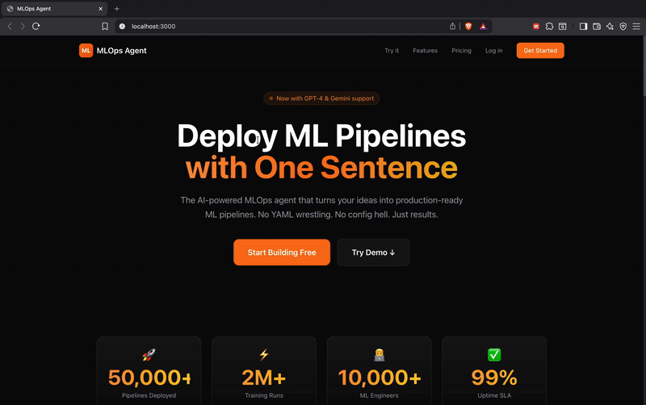

<div align="center">

# 🤖 Auto-MLOps Agent

**AI-powered MLOps pipeline automation using natural language**

[](https://www.python.org/downloads/)
[](https://opensource.org/licenses/MIT)
[](https://github.com/astral-sh/uv)
[](https://modelcontextprotocol.io/)

*Transform your ML projects with production-ready infrastructure using just natural language commands*

[Features](#-features) • [Quick Start](#-quick-start) • [Architecture](#-architecture) • [Tools](#-available-mcp-tools-28) • [Contributing](#-contributing)

## 🎬 Demo



### 📺 Video Tutorial

[](https://www.youtube.com/watch?v=yYLG49bwOMM)

▶️ **[Watch the Full Tutorial on YouTube](https://www.youtube.com/watch?v=yYLG49bwOMM)**

</div>

---

## 🎯 What is Auto-MLOps?

Auto-MLOps is an intelligent agent that automates the setup and management of ML pipelines. Give it a simple ML project and describe what you want in natural language — it will automatically configure:

- ⚙️ **Hydra** configuration management
- 📊 **MLflow** experiment tracking
- 📦 **DVC** data versioning with S3/GCS
- 🐳 **Docker** containerization
- 🔄 **GitHub Actions** CI/CD pipelines
- 🎯 **Self-improvement loop** when accuracy thresholds aren't met

### Example Usage

```plaintext
User: "Deploy this cat-dog classifier with accuracy threshold 0.85, 
       use S3 for data versioning, and set up CI/CD"

Agent: ✅ Analyzing project structure...
       ✅ Creating Hydra configs in /configs
       ✅ Initializing MLflow experiment
       ✅ Setting up DVC with S3 remote
       ✅ Creating Dockerfile
       ✅ Generating GitHub Actions workflow
       ✅ Running training...
       ✅ Accuracy: 0.87 - threshold met!
       📋 Summary: Pipeline complete, model ready for deployment
```

---

## ✨ Features

| Feature | Description |
|---------|-------------|
| 🧠 **Natural Language Interface** | Describe what you want, agent figures out the steps |
| 📊 **Graph-Based Planning** | Visualize and track execution as a DAG |
| 🔄 **Self-Improvement Loop** | Auto-retry training with tuned hyperparameters |
| 🔌 **28 MCP Tools** | Comprehensive MLOps operations via Model Context Protocol |
| 🎛️ **Configurable Profiles** | Quick, default, and production presets |
| 📝 **Experiment Memory** | Search past experiments by metrics and configs |

---

## 🚀 Quick Start

### Prerequisites

- Python 3.10+
- [uv](https://github.com/astral-sh/uv) (recommended) or pip
- Git

### Installation

```bash
# Clone the repository
git clone https://github.com/sagar431/Auto-mlops.git
cd Auto-mlops

# Install with uv (recommended)
uv sync

# Or with pip
pip install -e .

# Copy and configure environment variables
cp .env.example .env
# Edit .env with your API keys
```

### Run Tests

```bash
# Test all MCP tools
python test_mlops_tools.py

# Test specific tool categories
python test_mlops_tools.py --tool hydra
python test_mlops_tools.py --tool mlflow
python test_mlops_tools.py --tool dvc
```

---

## 🏗️ Architecture

```
┌─────────────────────────────────────────────────────────────────────────┐
│                         Auto-MLOps Agent                                 │
├─────────────────────────────────────────────────────────────────────────┤
│                                                                          │
│   User Query: "Deploy my model with accuracy > 0.85"                    │
│                              │                                           │
│                              ▼                                           │
│   ┌──────────────────────────────────────────────────────────────────┐  │
│   │                     PERCEPTION LAYER                              │  │
│   │  • Extract entities (model, accuracy threshold)                   │  │
│   │  • Detect pipeline stage (setup/data/training/eval/deploy)       │  │
│   │  • Route to decision or summarizer                                │  │
│   └──────────────────────────────────────────────────────────────────┘  │
│                              │                                           │
│                              ▼                                           │
│   ┌──────────────────────────────────────────────────────────────────┐  │
│   │                     DECISION LAYER                                │  │
│   │  • Generate graph-based execution plan                            │  │
│   │  • Select tools from 28 MCP operations                           │  │
│   │  • Handle dependencies between steps                              │  │
│   └──────────────────────────────────────────────────────────────────┘  │
│                              │                                           │
│                              ▼                                           │
│   ┌──────────────────────────────────────────────────────────────────┐  │
│   │                     ACTION LAYER                                  │  │
│   │  • Execute MCP tools (Hydra, MLflow, DVC, Docker, GitHub)        │  │
│   │  • Monitor training progress                                      │  │
│   │  • Trigger self-improvement if threshold not met                  │  │
│   └──────────────────────────────────────────────────────────────────┘  │
│                              │                                           │
│                              ▼                                           │
│   ┌──────────────────────────────────────────────────────────────────┐  │
│   │                   SUMMARIZATION LAYER                             │  │
│   │  • Generate experiment reports                                    │  │
│   │  • Log to memory for future reference                             │  │
│   └──────────────────────────────────────────────────────────────────┘  │
│                                                                          │
└─────────────────────────────────────────────────────────────────────────┘
```

---

## 📁 Project Structure

```
mlops_agent/
├── agent.py                     # CLI entry point
├── api_server.py                # FastAPI backend
├── mcp_mlops_tools.py           # Main MCP server (28 tools)
│
├── agent/                       # Core agent loop
│   ├── agent_loop.py            # Graph-based execution
│   ├── contextManager.py        # Experiment state tracking
│   ├── agentSession.py          # Session management
│   └── model_manager.py         # LLM provider management
│
├── perception/                  # Intent understanding
│   └── perception.py            # ML pipeline awareness
│
├── decision/                    # Planning
│   └── decision.py              # Graph-based step generation
│
├── action/                      # Execution
│   ├── executor.py              # Sandboxed execution
│   └── execute_step.py          # Training monitoring
│
├── summarization/               # Reporting
│   └── summarizer.py            # Experiment results
│
├── memory/                      # History
│   ├── memory_search.py         # Search by metrics
│   ├── experiment_logs/         # MLflow-style history
│   └── session_logs/            # Agent session logs
│
├── prompts/                     # LLM prompts
│   ├── perception_prompt.txt
│   ├── decision_prompt.txt
│   ├── summarizer_prompt.txt
│   └── improvement_prompt.txt   # Self-improvement loop
│
├── mcp_servers/                 # MCP configurations
│   ├── multiMCP.py
│   └── mcp_configs/
│
├── config/                      # Agent configuration
│   ├── models.json              # LLM providers
│   ├── profiles.yaml            # Execution profiles
│   └── mlops_defaults.yaml      # Default settings
│
├── templates/                   # Pipeline templates
│   ├── hydra/config.yaml
│   ├── dvc/dvc.yaml
│   ├── docker/Dockerfile.train
│   └── github/train.yml
│
├── pyproject.toml               # UV dependencies
└── test_mlops_tools.py          # Test suite
```

---

## 🔧 Available MCP Tools (28)

### ⚙️ Hydra Configuration (4 tools)

| Tool | Description |
|------|-------------|
| `analyze_project_config` | Analyze project structure for config needs |
| `create_hydra_config` | Create Hydra config structure (`/configs`) |
| `update_hydra_config` | Update configuration values |
| `validate_hydra_config` | Validate Hydra configurations |

### 📊 MLflow Tracking (8 tools)

| Tool | Description |
|------|-------------|
| `init_mlflow_experiment` | Initialize experiment |
| `start_mlflow_run` | Start a new run |
| `log_mlflow_params` | Log hyperparameters |
| `log_mlflow_metrics` | Log metrics (accuracy, loss) |
| `log_mlflow_artifact` | Log model artifacts |
| `register_mlflow_model` | Register in Model Registry |
| `get_best_mlflow_run` | Get best run by metric |
| `end_mlflow_run` | End run with status |

### 📦 DVC Data Versioning (7 tools)

| Tool | Description |
|------|-------------|
| `init_dvc_repo` | Initialize DVC in project |
| `configure_dvc_remote` | Configure S3/GCS remote |
| `add_data_to_dvc` | Add data for versioning |
| `create_dvc_pipeline` | Create `dvc.yaml` pipeline |
| `dvc_push` | Push data to remote |
| `dvc_pull` | Pull data from remote |
| `dvc_reproduce` | Run DVC pipeline |

### 🐳 Docker (4 tools)

| Tool | Description |
|------|-------------|
| `create_ml_dockerfile` | Create training Dockerfile |
| `build_ml_docker_image` | Build Docker image |
| `run_training_container` | Run training in container |
| `push_docker_image` | Push to registry |

### 🔄 GitHub Actions (2 tools)

| Tool | Description |
|------|-------------|
| `create_github_workflow` | Create CI/CD workflow |
| `add_workflow_step` | Add step to workflow |

### 🎯 Training Control (3 tools)

| Tool | Description |
|------|-------------|
| `analyze_training_results` | Analyze experiment results |
| `suggest_improvements` | AI-powered improvement suggestions |
| `check_accuracy_threshold` | Check if threshold is met |

---

## � Self-Improvement Loop

When training accuracy doesn't meet your threshold, the agent automatically:

```
Training Complete → Accuracy = 0.78 (Target: 0.85)
         │
         ▼
    ❌ Threshold NOT met
         │
         ▼
    Analyze MLflow results
         │
         ▼
    LLM suggests: "Lower learning rate to 0.001, increase epochs to 20"
         │
         ▼
    Update Hydra config
         │
         ▼
    Re-train (Attempt 2/3)
         │
         ▼
    Accuracy = 0.87 ✅ Threshold met!
```

---

## ⚙️ Configuration

### Environment Variables

```bash
# LLM Providers
OPENAI_API_KEY=sk-...
GOOGLE_API_KEY=...

# AWS (for DVC S3 remote)
AWS_ACCESS_KEY_ID=...
AWS_SECRET_ACCESS_KEY=...
DVC_REMOTE_URL=s3://your-bucket/dvc-storage

# Docker Registry
DOCKER_REGISTRY=ghcr.io
DOCKER_USERNAME=...

# Agent Settings
DEFAULT_ACCURACY_THRESHOLD=0.85
MAX_IMPROVEMENT_ATTEMPTS=3
```

### Execution Profiles

```yaml
# config/profiles.yaml

profiles:
  quick:     # Fast testing
    max_improvement_attempts: 1
    accuracy_threshold: 0.70
    
  default:   # Standard run
    max_improvement_attempts: 3
    accuracy_threshold: 0.85
    
  production: # Full pipeline
    max_improvement_attempts: 5
    accuracy_threshold: 0.90
```

---

## 🗺️ Roadmap

- [x] **Phase 1**: MCP Tools (28 tools) ✅
- [ ] **Phase 2**: Agent Architecture (in progress)
  - [x] Folder structure
  - [ ] Core agent loop
  - [ ] Perception/Decision/Action layers
- [ ] **Phase 3**: Self-Improvement Loop
- [ ] **Phase 4**: Frontend Integration
- [ ] **Phase 5**: Multi-cloud Support

---

## 🤝 Contributing

Contributions are welcome! Please feel free to submit a Pull Request.

1. Fork the repository
2. Create your feature branch (`git checkout -b feature/amazing-feature`)
3. Commit your changes (`git commit -m 'Add amazing feature'`)
4. Push to the branch (`git push origin feature/amazing-feature`)
5. Open a Pull Request

---

## 📄 License

This project is licensed under the MIT License - see the [LICENSE](LICENSE) file for details.

---

## 🙏 Acknowledgments

- [Model Context Protocol](https://modelcontextprotocol.io/) for the MCP framework
- [Hydra](https://hydra.cc/) for configuration management
- [MLflow](https://mlflow.org/) for experiment tracking
- [DVC](https://dvc.org/) for data versioning
- Inspired by [lightning-template-hydra](https://github.com/satyajitghana/lightning-template-hydra)

---

<div align="center">

**Built with ❤️ by [Sagar](https://github.com/sagar431)**

</div>
